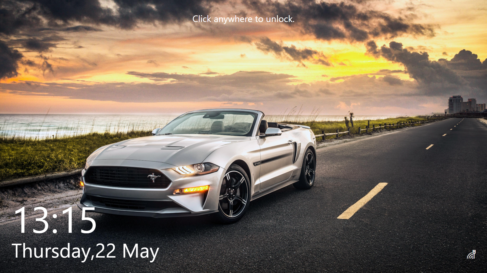
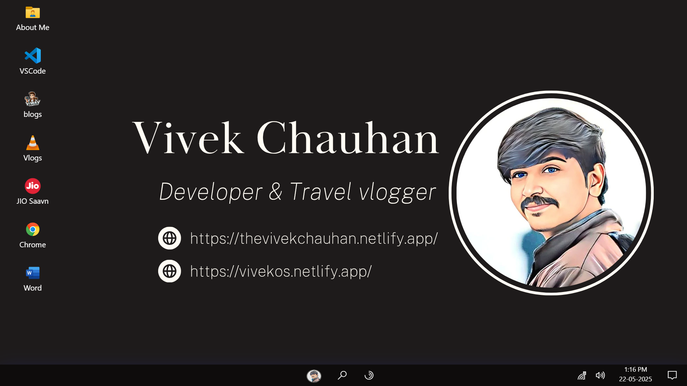

<h1 align="center">
   
  
   
  Portfolio OS Theme - Windows.
   
</h1>

<h4 align="center">A customizable portfolio website based on Microsoft Windows 10 theme with interactive desktop experience.</h4>

  <a href="#key-features">Key Features</a> • 
  <a href="#installation">Installation</a> • 
  <a href="#tech-stack">Tech Stack</a> •

 
    
    

## Key Features

* Windows 10/11 style desktop interface
* Interactive start menu and taskbar
* Draggable and resizable windows
* Customizable apps and shortcuts
* System notifications
* Dark/light theme support
* Contact form with EmailJS integration
* Firebase analytics integration
* Responsive design for all devices

## Tech Stack

* Frontend: React.js, React-Draggable, React-Router
* Styling: CSS Modules, Sass
* Animation: Framer Motion
* Form Handling: EmailJS
* Analytics: Firebase
* Build Tool: Vite (or Create-React-App)

## Deployment

* The project can be deployed to:

Vercel (recommended)
Netlify
GitHub Pages
Firebase Hosting
For Vercel deployment:
Connect your GitHub repository
Set environment variables
Deploy!
 

